# Dallas Cats & Dogs

This site portrays what a physical fictional Pet Store for cats and dogs offers in the sense of basic food and accessories in the Dallas Downtown area.

## Table of contents

- [Wireframes](#wireframes)
- [User-stories](#user-stories)
- [Technologies-used](#technologies-used)
- [Testing](#testing)
- [Deployment](#deployment)
- [License](#license)

## User stories

### User story 1:
I want a web page where I easily can see what the store offers before I go in and purchase.

### User story 2:
I want a web page were I easily can see the opening hours and contact information.

## Wireframes

#### - Phone

<table>
  <tr>
    <td align="center" valign="top">
      <h4>Landing page:</h4>
      
    </td>
    <td align="center" valign="top">
      <h4>Food page:</h4>
      
    </td>
    <td align="center" valign="top">
      <h4>Accessories page:</h4>
      
    </td>
  </tr>
</table>

#### Tablet

<table>
  <tr>
    <td align="center" valign="top">
      <h4>Landing page:</h4>
      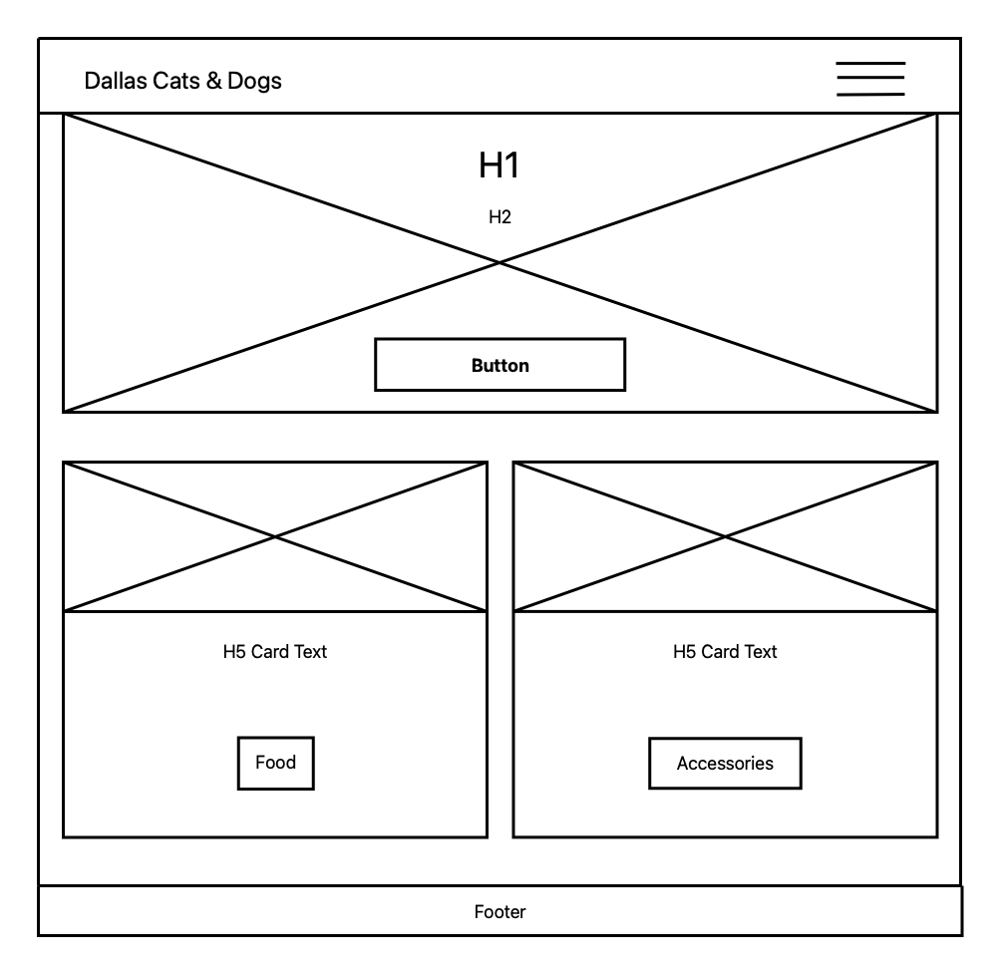
    </td>
    <td align="center" valign="top">
      <h4>Food page:</h4>
      
    </td>
    <td align="center" valign="top">
      <h4>Accessories page:</h4>
      
    </td>
  </tr>
</table>

#### Desktop:

<table>
  <tr>
    <td align="center" valign="top">
      <h4>Landing page:</h4>
      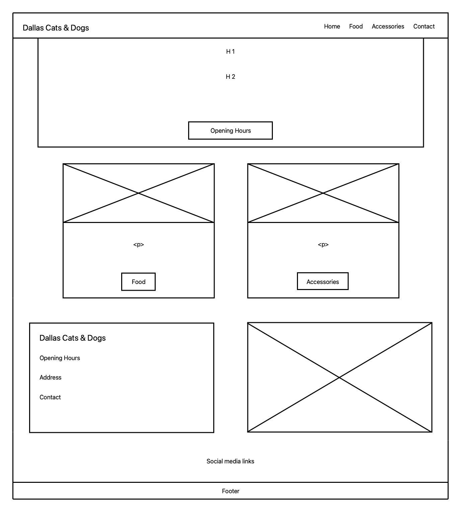
    </td>
    <td align="center" valign="top">
      <h4>Food page:</h4>
      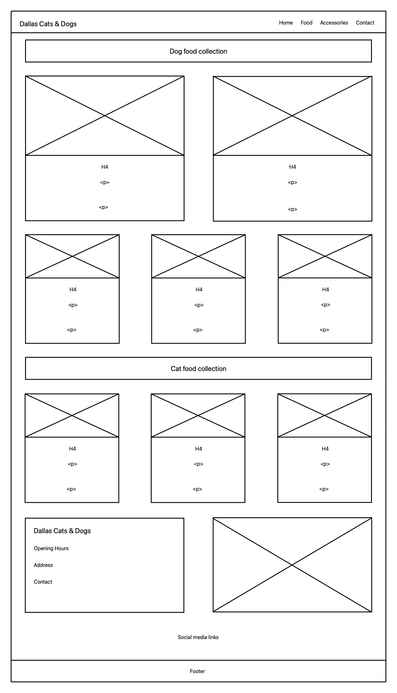
    </td>
    <tr>
      <td align="center" valign="top">
        <h4>Accessories page:</h4>
        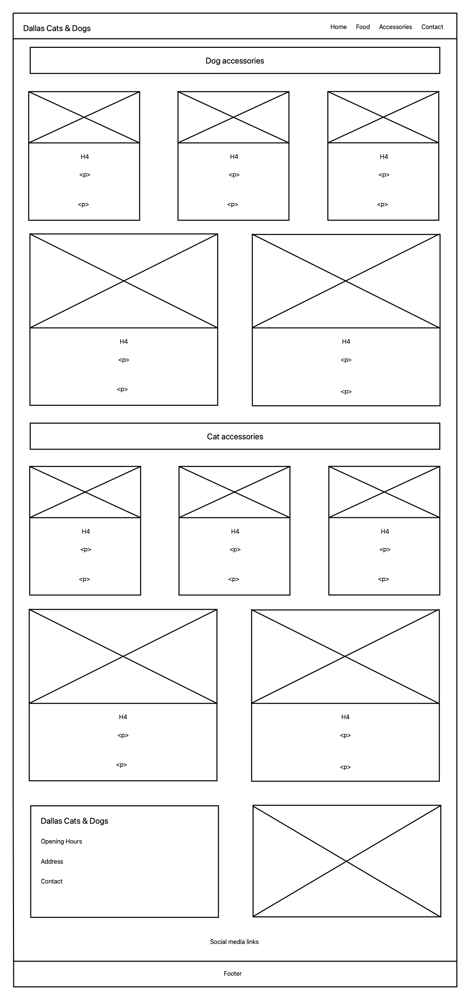
      </td>
    </tr>
  </tr>
</table>

## Technologies used

The following technologies were utilized in the development of this website:

Frontend

	•	HTML5: For structuring content and semantic elements.
	•	CSS3: For styling, animations, and layout designs.
	•	Includes responsive design using Flexbox and CSS Grid.
	•	Bootstrap 5: For pre-built responsive components, grid system, and utility classes.

  Version Control

	•	Git: For version tracking and collaboration.
	•	GitHub: For repository hosting, issue tracking, and deployment.

  Deployment

	•	GitHub Pages: For hosting and deploying the website (static sites).

  Testing

	•	Lighthouse: For performance, accessibility, SEO, and best practices auditing.
	•	W3C Validator: For validating HTML and CSS compliance.

  Additional Tools

	•	Font Awesome: For adding scalable icons to the website.
	•	Google Fonts: For custom typography.

## Testing

### Code validation

#### HTML

I've used the <a href="https://validator.w3.org">HTML W3C Validator</a> to validate all of my HTML files.

<table>
  <tr>
    <td align="center" valign="top">
      <h4>Page</h4>
      
Home

    </td>
     <td align="center" valign="top">
      <h4>W3C URL</h4>
      <a href="https://validator.w3.org">
W3C
</a>
    </td>
     <td align="center" valign="top">
      <h4>Screenshot</h4>
       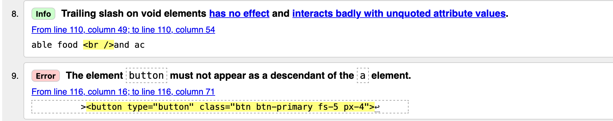
    </td>
     <td align="center" valign="top">
      <h4>Notes</h4>
      
Info: The trailing slash on void elements is just a product from using Prettier formating

         Error: Not really an error, just the validator not recognizing the Prettier formating
    </td>
  </tr>
  <tr>
    <td align="center" valign="top">
      
Food

    </td>
     <td align="center" valign="top">
      <a href="https://validator.w3.org">
W3C
</a>
    </td>
     <td align="center" valign="top">
       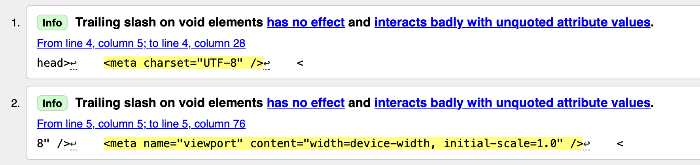
    </td>
     <td align="center" valign="top">
      
Info: The trailing slash on void elements is just a product from using Prettier formating

    </td>
  </tr>
  <tr>
    <td align="center" valign="top">
      
Accessories

    </td>
     <td align="center" valign="top">
      <a href="https://validator.w3.org">
W3C
</a>
    </td>
     <td align="center" valign="top">
       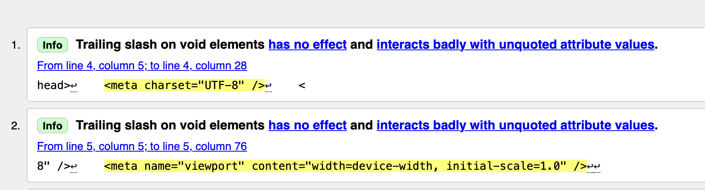
    </td>
     <td align="center" valign="top">
      
Info: The trailing slash on void elements is just a product from using Prettier formating

    </td>
  </tr>
</table>

#### CSS

I've used the <a href="https://jigsaw.w3.org/css-validator/">CSS W3C Validator</a> to validate all of my CSS files.

<table>
  <tr>
    <td align="center" valign="top">
      <h4>Page</h4>
      
Home

    </td>
     <td align="center" valign="top">
      <h4>W3C URL</h4>
      <a href="https://jigsaw.w3.org/css-validator/">
W3C
</a>
    </td>
     <td align="center" valign="top">
      <h4>Screenshot</h4>
       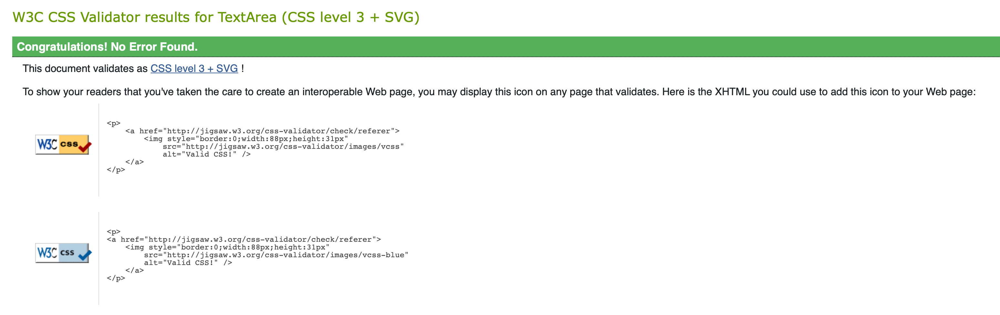
    </td>
     <td align="center" valign="top">
      <h4>Notes</h4>
      
Pass: No errors

    </td>
  </tr>
  <tr>
    <td align="center" valign="top">
      
Food

    </td>
     <td align="center" valign="top">
      <a href="https://jigsaw.w3.org/css-validator/">
W3C
</a>
    </td>
     <td align="center" valign="top">
       
    </td>
     <td align="center" valign="top">
      
Pass: No errors

    </td>
  </tr>
  <tr>
    <td align="center" valign="top">
      
Accessories

    </td>
     <td align="center" valign="top">
      <a href="">
W3C
</a>
    </td>
     <td align="center" valign="top">
       
    </td>
     <td align="center" valign="top">
      
Pass: No errors

    </td>
  </tr>
</table>

#### Lighthouse Audit

<table>
  <tr>
    <td align="center" valign="top">
      <h4>Page</h4>
      
Home

    </td>
    <td align="center" valign="top">
      <h4>Size</h4>
      
Mobile
    </td>
     <td align="center" valign="top">
      <h4>Screenshot</h4>
      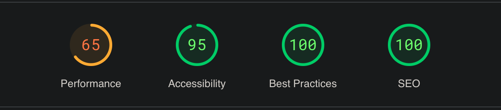
    </td>
     <td align="center" valign="top">
      <h4>Notes</h4>
      
Minor complaint: Touch targets do not have sufficient size or spacing.

    </td>
  </tr>
  <tr>
    <td align="center" valign="top">
      
Home

    </td>
    <td align="center" valign="top">
      
Desktop

    </td>
     <td align="center" valign="top">
      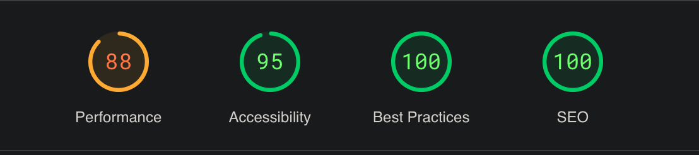
    </td>
     <td align="center" valign="top">
      
Minor complaint: Touch targets do not have sufficient size or spacing.

    </td>
  </tr>
  <tr>
    <td align="center" valign="top">
      
Food

    </td>
    <td align="center" valign="top">
      
Mobile
    </td>
     <td align="center" valign="top">
      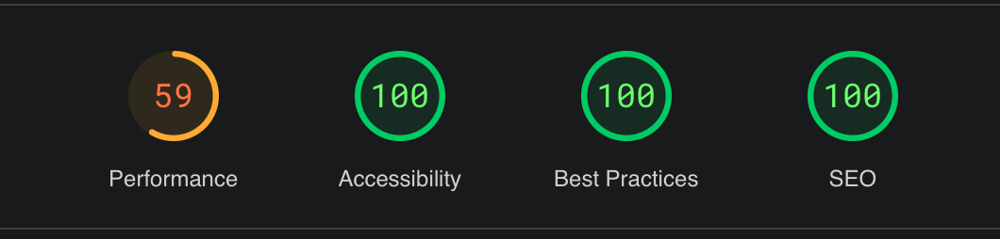
    </td>
     <td align="center" valign="top">
      
Syncing errors with Github, could not upload fixed complaints.

    </td>
  </tr>
  <tr>
    <td align="center" valign="top">
      
Food

    </td>
    <td align="center" valign="top">
      
Desktop

    </td>
     <td align="center" valign="top">
      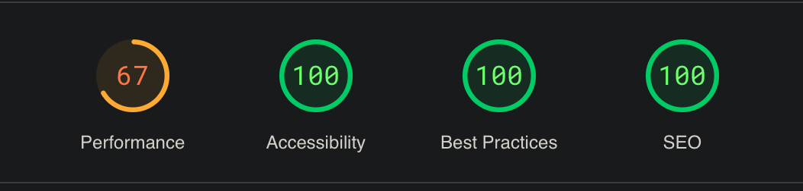
    </td>
     <td align="center" valign="top">
      
Syncing errors with Github, could not upload fixed complaints.

    </td>
  </tr>
  <tr>
    <td align="center" valign="top">
      
Accessories

    </td>
    <td align="center" valign="top">
      
Mobile
    </td>
     <td align="center" valign="top">
      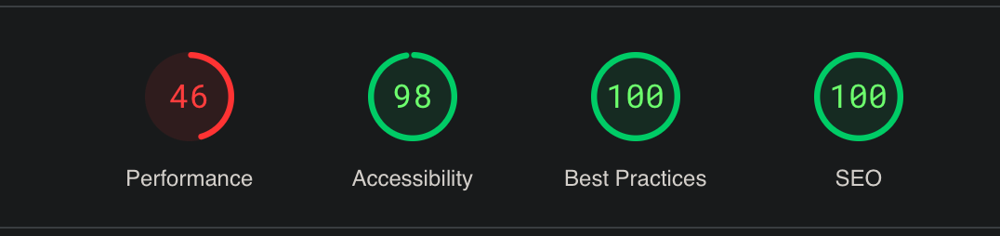
    </td>
     <td align="center" valign="top">
      
Syncing errors with Github, could not upload fixed complaints.

    </td>
  </tr>
  <tr>
    <td align="center" valign="top">
      
Accessories

    </td>
    <td align="center" valign="top">
      
Desktop

    </td>
     <td align="center" valign="top">
      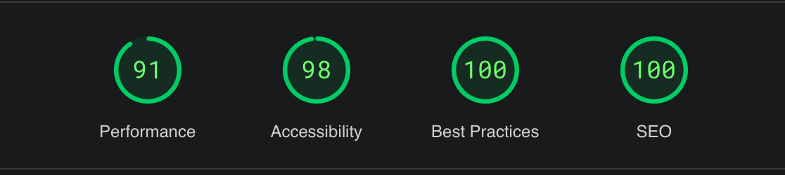
    </td>
     <td align="center" valign="top">
      
Syncing errors with Github, could not upload fixed complaints.

    </td>
  </tr>
</table>

## Deployment

### Browser Compatibility

I've tested my deployed project on multiple browsers to check for compatibility issues.

<table>
  <tr>
    <td align="center" valign="top">
      <h4>Browser</h4>
      
Safari

    </td>
     <td align="center" valign="top">
      <h4>Screenshot</h4>
       
    </td>
    <td align="center" valign="top">
      <h4>Screenshot</h4>
       
    </td>
    <td align="center" valign="top">
      <h4>Screenshot</h4>
       
    </td>
     <td align="center" valign="top">
      <h4>Notes</h4>
      
Work as expected

    </td>
  </tr>
   <tr>
    <td align="center" valign="top">
      
Brave

    </td>
     <td align="center" valign="top">
       
    </td>
    <td align="center" valign="top">
       
    </td>
    <td align="center" valign="top">
       
    </td>
     <td align="center" valign="top">
      
Work as expected

    </td>
  </tr>
  <tr>
    <td align="center" valign="top">
      
Firefox

    </td>
     <td align="center" valign="top">
       
    </td>
    <td align="center" valign="top">
       
    </td>
    <td align="center" valign="top">
       
    </td>
     <td align="center" valign="top">
      
Work as expected

    </td>
  </tr>
</table>

### Responsiveness

I've tested my deployed project on multiple devices to check for responsivness issues.

<table>
<tr>
    <td align="center" valign="top">
      <h4>Device</h4>
      
Mobile (Dev Tools)

    </td>
     <td align="center" valign="top">
      <h4>Screenshot</h4>
       
    </td>
    <td align="center" valign="top">
      <h4>Screenshot</h4>
       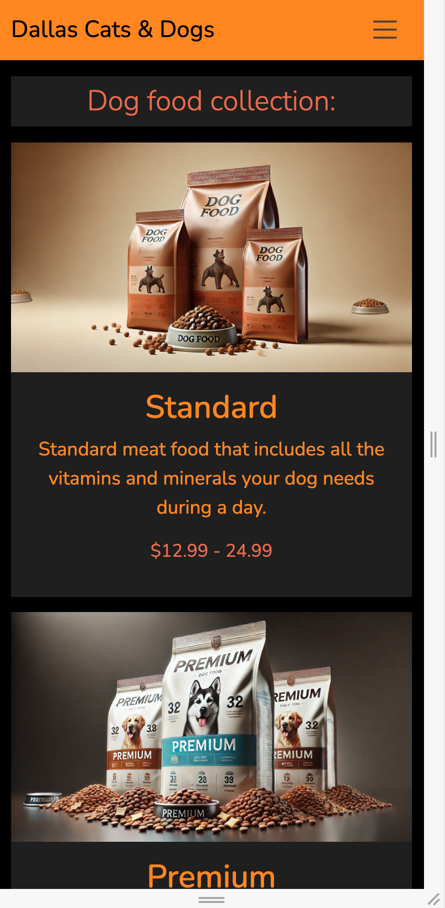
    </td>
    <td align="center" valign="top">
      <h4>Screenshot</h4>
       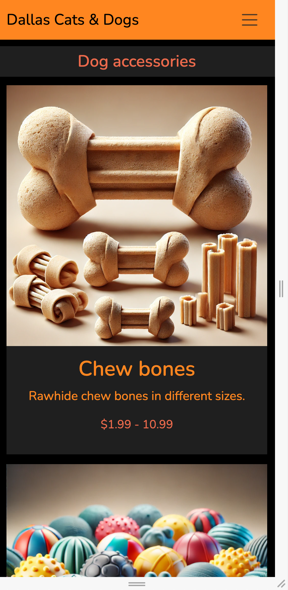
    </td>
     <td align="center" valign="top">
      <h4>Notes</h4>
      
Work as expected

    </td>
  </tr>
  <tr>
   <td align="center" valign="top">
      
Tablet (Dev Tools)

    </td>
     <td align="center" valign="top">
       
    </td>
    <td align="center" valign="top">
       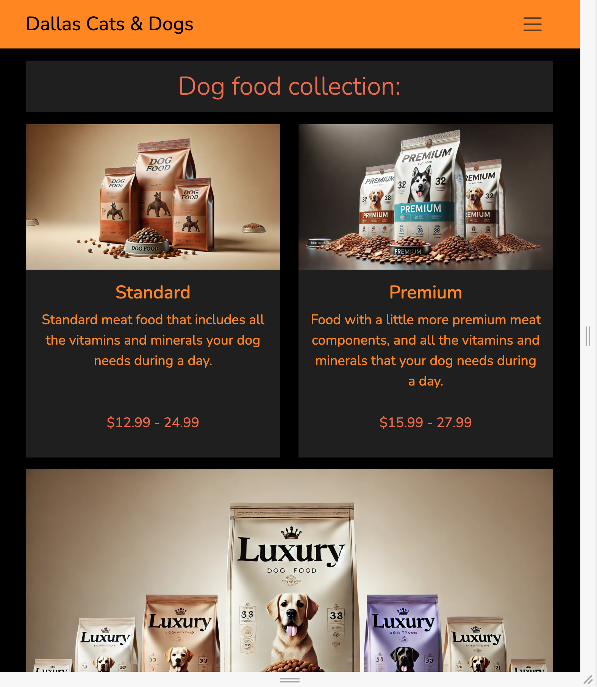
    </td>
    <td align="center" valign="top">
       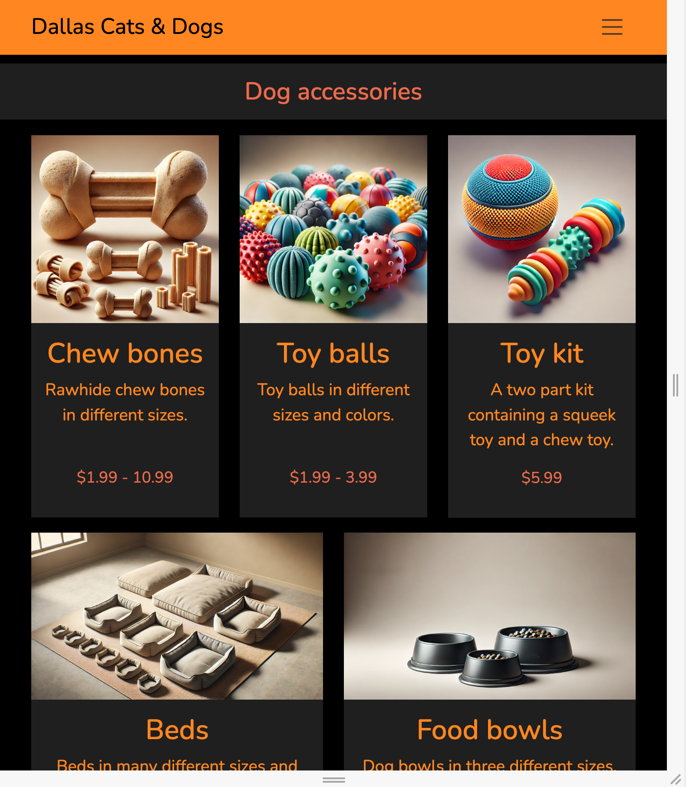
    </td>
     <td align="center" valign="top">
      
Work as expected

    </td>
  </tr>
  <tr>
   <td align="center" valign="top">
      
Desktop

    </td>
     <td align="center" valign="top">
       
    </td>
    <td align="center" valign="top">
       
    </td>
    <td align="center" valign="top">
       
    </td>
     <td align="center" valign="top">
      
Work as expected

    </td>
  </tr>
  <tr>
   <td align="center" valign="top">
      
iPhone 14 Pro

    </td>
     <td align="center" valign="top">
       
    </td>
    <td align="center" valign="top">
       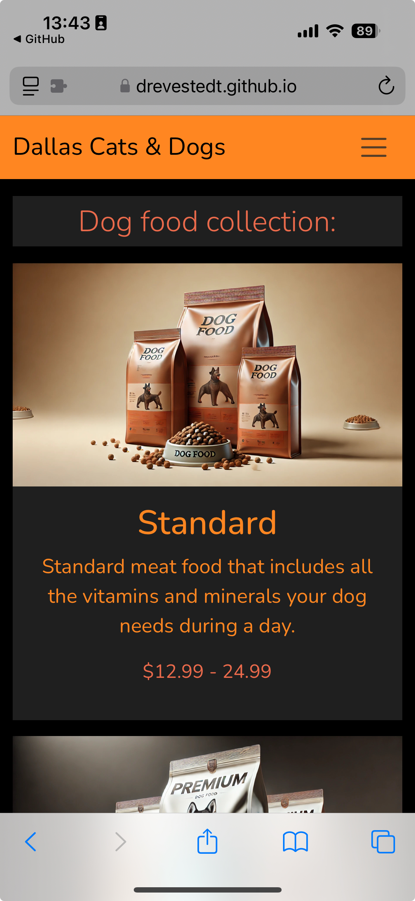
    </td>
    <td align="center" valign="top">
       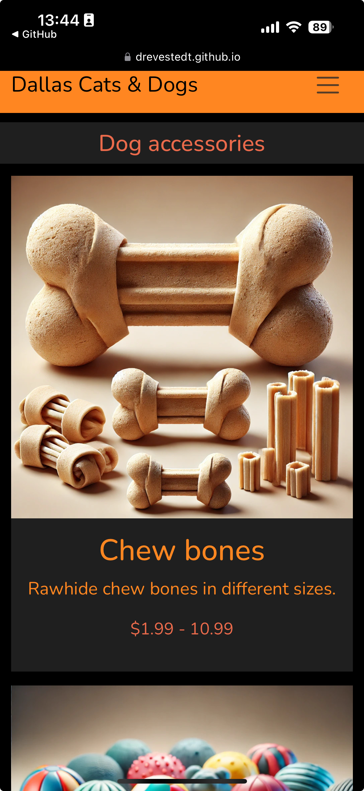
    </td>
     <td align="center" valign="top">
      
Work as expected

    </td>
  </tr>
  <tr>
   <td align="center" valign="top">
      
iPad Pro 13"

    </td>
     <td align="center" valign="top">
       
    </td>
    <td align="center" valign="top">
       
    </td>
    <td align="center" valign="top">
       
    </td>
     <td align="center" valign="top">
      
Work as expected

    </td>
  </tr>
</table>

## License
